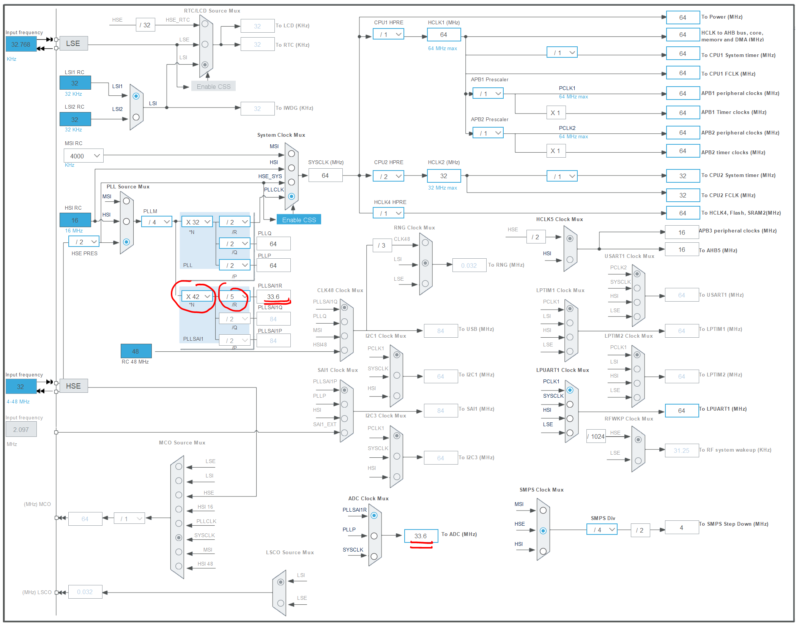

# Modulation of TIC

The signal of TIC is a 50KHz sin wave modulated by a serial signal at 1200 bauds (for historical format, and 9600 bauds for the new one).

In order to decode it using ADC, we need to sample the sin wave at a higher frequency. We chose 150KHz (3x the base frequency) to be able to have at least 2 measurements not null.

For 1200 bauds, we will deal with 150/1.2 or **125** samples of the sin wave per bit.

For 9600 bauds, it will be 150/9.6 or **15.6** samples

It seems enough to get a fair idea of bits hidden behind the sin waves

# ADC, sampling, converting

The STM32's ADC is able to achieve 12 bits measurements at frequencies higher than 1MHz. We don't need that much. 150KHz is 10% of the capacity and 8 bits is enough to get an idea of bearer presence or not.

ADC use a specific clock than can be derived from internal CPU clock or an alternative one based on a PLL (choice we made)

Sampling (the time the switch opens to sync its capacitance before converting) can be ajusted to a various range of clocks ticks from the PLL entry frequency (and you can choose different ones for differents entries if needed)

So 8 bits conversion takes only 8.5 clock cycles

So as ADC PLL clock has constraints (of being above 1MHz or such), 47.5 cycles for sampling and 8.5 for ADC conversion equals 56 cycles. So 150KHz times 56 will bring me to 8.4MHz for my PLL. But I can choose a higher frequency and use a divider :

I choose /4 that brings me to a more PLL friendly frequency of 33.6MHz. As the input frequency of my PLL will be 32MHZ / 2 /4 or 4MHZ, the division of 33.6 by 4 is the fraction 42/5. I'm done.

So to sum up, I maximise my sampling time on a ratio of 47.5/56 or I will be samping 85% of the time and converting 15%. So when my 50KHz sin wave will be cut in 3 parts, I will have at least one 100% positive or negative.

# extracting bits

The signal from the linky is DC zeroed with a scale of two resistor to half of 3.3V and reduced to fit in the 0 - 3.3V range of the ADC. 

We get something like that :

On the ADC, 0V equals value 0x00 and 3.3V 0xff (for 8 bits conversion). 

## shaping

We need to make some calculation on the raw signal :
- average on a long period, as we have part of signal with raw bearer (the 50KHz sin) and other with a very flat sin wave (of few milivolts)
- then keeping the amplitude of signal compared to the average line (to get energy of signal)
- then averaging the energy between 0 and 1 train of bits
- then filtering measurements on 3 successive 150KHz sample to get an actual idea if we have some energy on the 50KHz period (we are not constraint by the signal sync because we will have many period of the bearer present or absent)

Here are the samples at 150KHz (for a 1200 bauds TIC flow) just substracted from average value (0x7F) calculated :

Or maybe just a few bits :

You can see the nice pattern as the 50KHz linky and my 150KHz are not perfectly matched. One bit is around 125 values (or 42 sins) : it matchs. 

Just few measurements to see the 3 samples per sin wave period :

The measurements of energy varies for the bearer between :
- 2 strongs values and one small (here 29,29 and 0) : sum 58
- 1 stronger value and two mid values (here 18,24,18) : sum 60 ... quite constant indeed

It's enough to tell the good from the bad as no bearer is 0 or 1 value (mostly 0)

## alternance (spacing) measurements

So for each ADC value read we calculate the sum of the energies of the center measure and the 2 around. Is the sum is above a given fraction of the "average energy" calculated before, we say it's a high else a low. As Linky TIC modulation use inverted logic, a high (bearer presence) means "bit 0", and a low (no bearer or almost nothing) means "bit 1".

The serial signal is as follow :
- one start bit (0)
- seven data bits (0 or 1)
- one parity bit (0 or 1) : odd
- one stop bit (1)

At the end of one sequence (line) we can have long periods of 1 (no bearer), or an infinite stop bit.

On the following scheme, the yellow braces means : under threshold (so a bit 1) and the purple means : over threshold (so bit 0)

As we now have high and lows (binaries values), we need to measure the spacing between each change of value (as they occurs only every 125 ADC cycle at least), then feed a shift register at each change.

# baud rate estimation

To estimate the baudrate (before extracting any bit), we need to calculate the minimum period between two changes (in my case around 120, as I get a spread between 122 and 127, as my 0 bit last a bit longer than the 1 bit, as I didn't tune my energy trigger that much).

## 0101, but sometimes 1000000001

Serial protocol is not manchester code or anything fancy to easily find the clock, so I use a buffer and count for each spacing possible 125,250,... the number of occurences of different duration of bits. Once I reach a high number on one counter I use a comb algorithm to find the most probable baud rate.

Here is the distribution :

So we never have more than 6 consecutive 0, okay. The maximum could be 9 if :
- first 0 for start bit
- seven successive 0 as data (0x00)
- parity (also 0)
- stop bit (1)

But thanks to enedis linky frames we limit at 6.
So when we divide the duration between 2 changes by this N number, we must be right for the number of 0 or 1 bit. In our case it has to be 121. If too small we risk to treat a 6 bits gap as 7 and if too hight we will loose some 1 bit sequence.

Here any N between 756/7=108 and 121 will be fine. But this is not how the programm will work, we need better ;-)

## comb algorithm

To find the best spacing who better fit our distribution we will use a comb. Each tooth of the comb will match each ray of our distribution.

We start with a comb with 9 tooth spaced of 10, and make the sum of buf[10]+buf[20]+..+buf[90] rate the value for the comb of 10, then do for 11,..., 150. The value around 125 will rise as the best rated cumb. We substrat 8% from it and get our value.

As the uppers rays of the distribution are more precise (as we measure up to 6 bits) we give them more credit in the scoring of the cumb.

